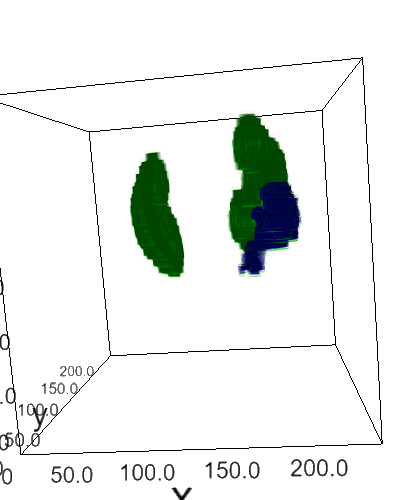
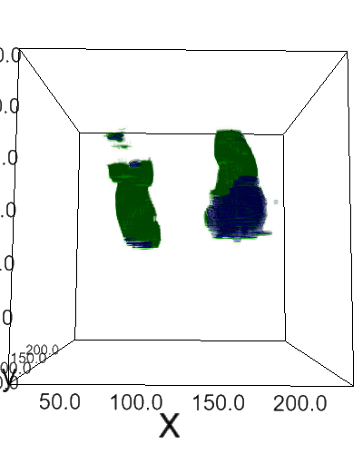

# kits19-cnn
Using 2D & 3D convolutional neural networks for the [2019 Kidney and Kidney Tumor Segmentation Challenge](https://kits19.grand-challenge.org/). This repository is associated with this [conference paper (older version)](https://www.researchgate.net/publication/336247303_A_2D_U-Net_for_Automated_Kidney_and_Renal_Tumor_Segmentation).




## Disclaimer
I'm not sure why the tumor scores are so low for all of the architectures, so I'm open to any suggestions and PRs! Am actively working on improving them.

## Downloading the Dataset
The recommended way is to just follow the instructions on the [original kits19 Github challenge page](https://github.com/neheller/kits19), which utilizes `git lfs`.
Here is a brief run-down for Google Colaboratory:
```
! sudo add-apt-repository ppa:git-core/ppa
! curl -s https://packagecloud.io/install/repositories/github/git-lfs/script.deb.sh | sudo bash
! sudo apt-get install git-lfs
! git lfs install
% cd "/content/"
! rm -r kits19
! git clone https://github.com/neheller/kits19.git
# takes roughly 11 minutes to download
```

## Results
<table>
  <tbody>
    <tr>
      <!-- header row -->
      <th>Neural Network</th>
      <th align="center">Parameters</th>
      <th align="center">Local Test (Tumor-Kidney) Dice</th>
      <th align="center">Local Test (Tumor Only) Dice</th>
      <th align="center">Weights</th>
    </tr>
    <!--row (person information)-->
    <tr>
      <td align="center">2D nnU-Net</td>
      <td align="center">12M</td>
      <td align="center">0.90</td>
      <td align="center">0.26</td>
      <td align="center">...</td>
    </tr>
    <tr>
      <td align="center">3D nnU-Net</td>
      <td align="center">29.6M</td>
      <td align="center">0.86</td>
      <td align="center">0.22</td>
      <td align="center">...</td>
    </tr>
    <tr>
      <td align="center">ResNet34 + U-Net Decoder</td>
      <td align="center">24M</td>
      <td align="center">0.90</td>
      <td align="center">0.29</td>
      <td align="center">...</td>
    </tr>
    <tr>
      <td align="center">ResNet34 + FPN Decoder</td>
      <td align="center">22M</td>
      <td align="center">0.83</td>
      <td align="center">0.29</td>
      <td align="center">...</td>
    </tr>
  </tbody>
</table>


## How to Use

### Preprocessing
To do general preprocessing (resampling):
```
# preprocessing
from kits19cnn.io.preprocess import Preprocessor
base_dir = "/content/kits19/data"
out_dir = "/content/kits_preprocessed"

preprocess = Preprocessor(base_dir, out_dir)
preprocess.cases = sorted(preprocess.cases)[:210]
%time preprocess.gen_data()
```
Note that the standardization and clipping is done on-the-fly.

If you want to do __2D segmentation__:
```
# preprocessing
from kits19cnn.io.preprocess import Preprocessor
out_dir = "/content/kits_preprocessed"

preprocess = Preprocessor(out_dir, out_dir, with_mask=True)
preprocess.cases = sorted(preprocess.cases)[:210]
preprocess.save_dir_as_2d()
```
If you want to do __binary 2D segmentation__ (kidney only or renal tumor only).
```
import os
from kits19cnn.experiments.utils import parse_fg_slice_dict_single_class
preprocessed_dir = "/content/kits_preprocessed"

json_path = os.path.join(preprocessed_dir, "slice_indices.json")
out_path = os.path.join(preprocessed_dir, "slice_indices_tu_only.json")

_ = parse_fg_slice_dict_single_class(json_path, out_path, removed_fg_idx="1")
out_path = os.path.join(preprocessed_dir, "slice_indices_kidney_only.json")
_ = parse_fg_slice_dict_single_class(json_path, out_path, removed_fg_idx="2")
```

### Training
Please see the example yaml file at `script_configs/train.yml`. Works for 2D, 2.5D,
and 3D. Also, supports binary 2D segmentation if you change the `slice_indices_path`.
Also, supports classification + segmentation for nnU-Net (doesn't work that well).
```
python /content/kits19-cnn/scripts/train_yaml.py --yml_path="/content/kits19-cnn/script_configs/train.yml"
```
__TensorBoard__: Catalyst automatically supports tensorboard logging, so just run this in Colaboratory:
```
# Load the TensorBoard notebook extension
%load_ext tensorboard
# Run this before training
%tensorboard --logdir logs
```
__For Plotting Support (plotly/orca) [OPTIONAL]:__
The regular training script (`script_configs/train.yml`) doesn't plot the graphs
directly, but saves them as .png files. If you don't want to do all of this installing, just exclude `plot_params` in `scripts/train_yaml.py`
```
# on colab

# installing anaconda and plotly with orca + dependencies
!wget https://repo.anaconda.com/miniconda/Miniconda3-latest-Linux-x86_64.sh
!chmod +x Miniconda3-latest-Linux-x86_64.sh
!bash ./Miniconda3-latest-Linux-x86_64.sh -b -f -p /usr/local
# !conda install -c plotly plotly-orca
!conda install -c plotly plotly-orca psutil requests ipykernel
!export PYTHONPATH="${PYTHONPATH}:/usr/local/lib/python3.7/site-packages/"
!pip install nbformat

# orca with xvfb support (so orca can save the graphs)
# Plotly depedencies
!apt-get install -y --no-install-recommends \
        wget \
        xvfb \
        libgtk2.0-0 \
        libxtst6 \
        libxss1 \
        libgconf-2-4 \
        libnss3 \
        libasound2 && \
mkdir -p /home/orca && \
cd /home/orca && \
wget https://github.com/plotly/orca/releases/download/v1.2.1/orca-1.2.1-x86_64.AppImage && \
chmod +x orca-1.2.1-x86_64.AppImage && \
./orca-1.2.1-x86_64.AppImage --appimage-extract && \
printf '#!/bin/bash \nxvfb-run --auto-servernum --server-args "-screen 0 640x480x24" /home/orca/squashfs-root/app/orca "$@"' > /usr/bin/orca && \
chmod +x /usr/bin/orca

# enabling xvfb
import plotly.io as pio
pio.orca.config.use_xvfb = True
pio.orca.config.save()
```

### Inference
Please see the example yaml file at `script_configs/pred.yml`. There's a tumor-only
example in `script_configs/infer_tu_only/pred.yml`.
```
# kidney-tumor
python /content/kits19-cnn/scripts/predict.py --yml_path="/content/kits19-cnn/script_configs/pred.yml"
# tumor only
python /content/kits19-cnn/scripts/predict.py --yml_path="/content/kits19-cnn/script_configs/infer_tu_only/pred.yml"
```

### Evaluation
Please see the example yaml file at `script_configs/eval.yml`. There's a tumor-only
example in `script_configs/infer_tu_only/eval.yml`.
```
# kidney-tumor
python /content/kits19-cnn/scripts/evaluate.py --yml_path="/content/kits19-cnn/script_configs/eval.yml"
# tumor only
python /content/kits19-cnn/scripts/evaluate.py --yml_path="/content/kits19-cnn/script_configs/infer_tu_only/eval.yml"
```

### Submission
Currently, only on the `preprocess-test-set` branch.

## Torch/Catalyst Pipeline (Overview)
### Preprocessing
* Resampling to 3.22 × 1.62 × 1.62 mm
* Isensee's nnU-Net methodology
  * Clipping to the [0.5, 99.5] percentiles and applying z-score standardization

### Training
* Foreground class sampling
  * __2D:__ Done by sampling per slice (loading only 2D arrays)
    * __SO MUCH FASTER THAN LOADING 3D ARRAYS__
      * Difference: 3 seconds v. 5 minutes per epoch
  * __3D:__ Done through `ROICropTransform`
* Data Augmentation
  * Located in `kits19cnn/experiments/utils.py`
    * Pay attention to the `augmentation_key`s in `get_training_augmentation` and `get_validation_augmentation`
  * Done through `batchgenerators` + my own custom transforms
* SGD (lr=1e-4) and LRPlateau (factor=0.15 and patience=5); BCEDiceLoss
  * 2D: batch size = 18 (regular training)
  * 3D: batch size = 4 (fp16 training)

### Architectures
* 2D (patch size: (256, 256))
  * Vanilla 2D nnU-Net
    * 6 pools with convolutional downsampling and upsampling
    * max number of filters set to 320 and the starting number is 30
  * 2D U-Net with pretrained ImageNet classifiers
  * 2D FPN with pretrained ImageNet classifiers
* 3D (patch size: (96, 160, 160))
  * 3D nnU-Net
    * 5 pools with convolutional downsampling and upsampling
    * max number of filters set to 320 and the starting number is 30
  * 3D nnU-Net (Classification + Segmentation)
